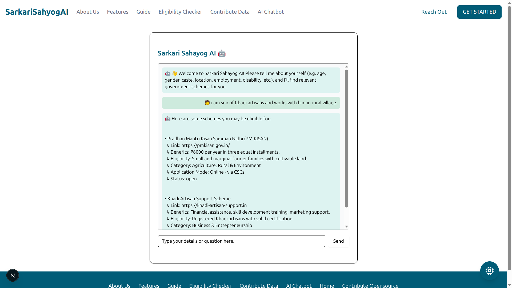

# 🇮🇳 Sarkari Sahayog AI

> An AI-powered platform that helps Indian citizens explore and determine eligibility for government schemes effortlessly — no login required!

<p align="center">
  
  
</p>


---

## 🌐 Frontend (User Interface)

- **Framework:** [Next.js 14](https://nextjs.org/) – SEO-friendly, fast, with support for SSR/ISR.
- **UI Library:** [Tailwind CSS](https://tailwindcss.com/) + [ShadCN UI](https://ui.shadcn.dev/) – Beautiful, reusable components.
- **Forms & Validation:** [React Hook Form](https://react-hook-form.com/) – Lightweight and efficient for managing user inputs.

---

## 🛠 Backend (API & Logic)

- **API Routes:** Built using Next.js 14 App Router (`app/api/`)
- **Route Protection:** Middleware to secure sensitive routes
- **Eligibility Logic:** Rule-based MongoDB queries (with optional ML integrations)
- **Chatbot Intelligence:** Integrated Gemini Flash 2.0 via Google GenAI SDK

---

## 🗄 Database (Storage & Session)

- **DBMS:** [MongoDB Atlas](https://www.mongodb.com/cloud/atlas) – Cloud-native NoSQL storage.
- **ORM:** [Mongoose](https://mongoosejs.com/) – Schema definitions and data modeling.
- **Session Handling:** MongoDB adapter using Mongoose.

---

## 🤖 AI & ML (Smart Features)

- **Chatbot Assistant:** Powered by **Gemini Flash 2.0**
- **Natural Language Understanding:** Through Google GenAI SDK
- **Eligibility Prediction:** Rule-based system using MongoDB queries, with room to scale to ML models

---

## ☁️ Hosting & Deployment

- **Frontend Hosting:** [Vercel](https://vercel.com/)
- **Database Hosting:** [MongoDB Atlas](https://www.mongodb.com/cloud/atlas)
- **CI/CD Pipeline:** GitHub Actions + Docker (Automated testing, building, and deployment)

---

## 🧩 Folder Structure

```
src/
├── app/                     # Next.js App Directory
│   ├── api/                 # API Routes
│   │   ├── chatbot/route.ts
│   │   └── schemes/
│   │       └── eligible/route.ts
│   ├── chat/page.tsx        # Chatbot UI
│   ├── eligibility-checker/ # Eligibility UI
│   └── schemes/new/         # Post new scheme UI
│
├── components/              # Reusable UI components
│   └── ui/                  # Buttons, cards, dropdowns, etc.
│
├── lib/                     # Helpers and utils
│   └── mongoose.ts          # Mongoose connection config
│
├── models/                  # MongoDB models
│   └── Scheme.ts            # Scheme metadata schema
```

---

## 🚀 Getting Started

```bash
# Install dependencies
npm install

# Run development server
npm run dev
```

---

## 📦 Tech Stack

| Layer        | Tech                           |
|--------------|--------------------------------|
| Frontend     | Next.js 14, Tailwind CSS, ShadCN UI |
| Forms        | React Hook Form                |
| Backend API  | Next.js API Routes             |
| Auth & Logic | Middleware + Rule-based checks |
| AI / NLP     | Gemini Flash 2.0 (GenAI)       |
| Database     | MongoDB Atlas + Mongoose       |
| Hosting      | Vercel + MongoDB Atlas         |
| DevOps       | GitHub Actions, Docker         |

---

## 📌 To-Do / Roadmap

- [ ] Add multi-language support (Hindi, Bengali, etc.)
- [ ] Integrate ML model for predictive eligibility
- [ ] Scheme bookmarking and sharing
- [ ] Admin dashboard for scheme management
- [ ] Visual analytics on scheme coverage

---

## 🤝 Contributing

Pull requests and feedback are welcome! For major changes, please open an issue first to discuss what you'd like to change.

---

## 📜 License

This project is licensed under the MIT License.

---

> Built with ❤️ to empower every Indian citizen.
